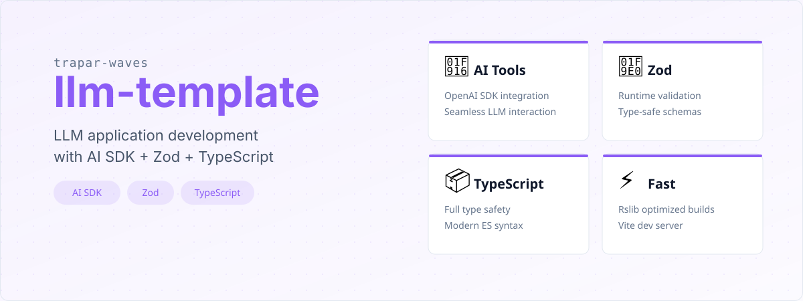

# @trapar-waves/llm-template


---

[中文](./readme/README-CN.md) | [日本語](./readme/README-JP.md) | [Русский язык](./readme/README-RU.md)

> A production-ready template for LLM (Large Language Model) application development, integrating AI tools, TypeScript type safety, Zod validation, and modern dev utilities.




- **Type Safety:** Leverages TypeScript to improve code quality and reduce runtime errors.
- **Fast Development Workflow:** Utilizes Vite for quick server starts and hot module replacement.
- **Optimized Builds:** Employs Rslib for efficient library bundling and optimized production outputs.
- **AI Integration:** Pre-configured with `@ai-sdk/openai` and `ai` for seamless interaction with large language models.
- **Robust Validation:** Utilizes Zod for runtime schema validation, ensuring data integrity.
- **Focus on Testing:** Includes Vitest for fast and reliable unit testing.
- **Code Consistency:** Enforces code style and quality using Prettier and Antfu's ESLint configuration.
- **Environment Management:** Uses `dotenv` for secure configuration of API keys and environment-specific settings.
- **Cross-Platform Paths:** Employs `pathe` for consistent file path handling across different operating systems.


- **Language:** TypeScript
- **LLM Framework:** AI SDK (`@ai-sdk/openai`, `ai`)
- **Validation:** Zod
- **Testing Framework:** Vitest
- **Build Tool:** Rslib
- **Development Server:** Vite
- **Code Quality:** ESLint (Antfu's config), Prettier
- **Utilities:** Dotenv, Pathe

See the [package.json](./package.json) for a full list of dependencies.


### Prerequisites

- Node.js (>= 18.x recommended)
- Package manager (npm, yarn, or pnpm)

### Installation

1. Create a new project using the template:

   ```bash
   pnpm create trapar-waves
   ```

2. Navigate to your project directory and install dependencies:

   ```bash
   pnpm install
   ```

3. Start the development server:

   ```bash
   pnpm dev
   ```


```
├── src/                # Source code
│   ├── model/          # LLM model configuration and interactions
│   ├── prompt/         # Prompt templates and test data
│   └── index.ts        # Entry point
├── tests/              # Unit tests
├── rslib.config.ts     # Rslib configuration
├── vitest.config.ts    # Vitest configuration
├── tsconfig.json       # TypeScript configuration
├── eslint.config.js    # ESLint configuration
└── package.json        # Project dependencies and scripts
```


Contributions are welcome and greatly appreciated! Please follow these steps to contribute:

1. Fork the repository
2. Create your feature branch (`git checkout -b feature/amazing-feature`)
3. Commit your changes (`git commit -m 'Add some amazing feature'`)
4. Push to the branch (`git push origin feature/amazing-feature`)
5. Open a Pull Request


MIT License © 2025 Trapar Waves

## 👤 Author

- **Rikka:** [admin@rikka.cc](mailto:admin@rikka.cc)
- **GitHub Profile:** [Muromi-Rikka](https://github.com/Muromi-Rikka)

## 🔗 Links

- **Repository:** [https://github.com/Trapar-waves/llm-template](https://github.com/Trapar-waves/llm-template)
- **Issues:** [https://github.com/Trapar-waves/llm-template/issues](https://github.com/Trapar-waves/llm-template/issues)
